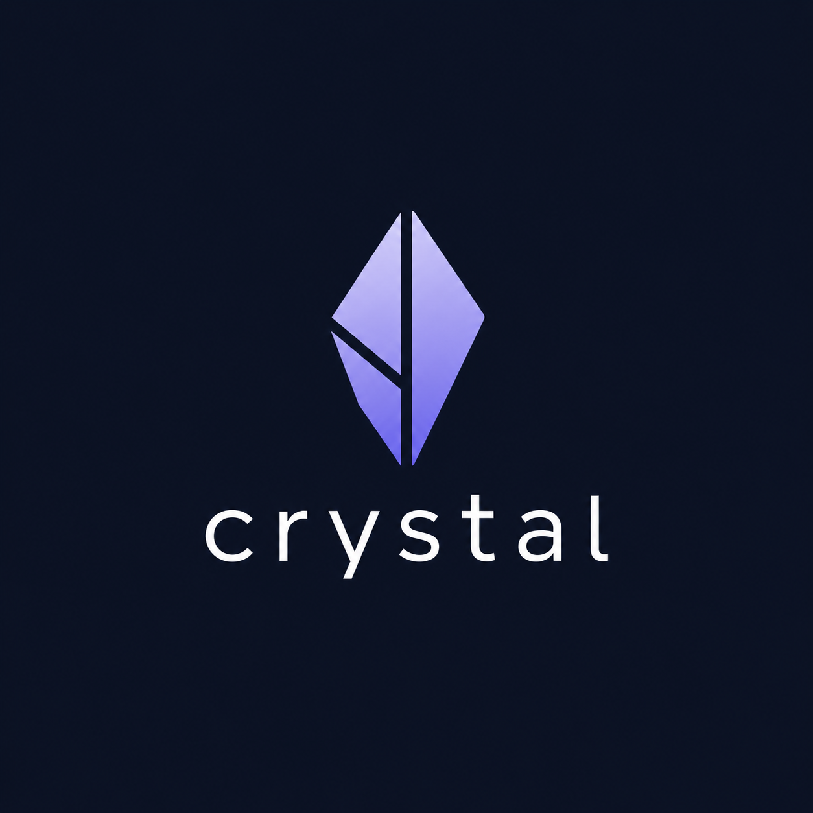

# Crystal - Distributed Key-Value Store

<p align="center">
  
</p>

Crystal is a distributed key-value store implementing RAFT consensus algorithm with log replication, written in Golang.

## Features

### Implemented Features
- **RAFT Consensus**: Basic RAFT implementation with leader election
- **Log Replication**: Write operations are replicated across cluster nodes
- **Leader-Based Writes**: Only the cluster leader can accept write operations
- **Internal Communication**: REST-based communication between nodes
- **Thread Safety**: Concurrent-safe operations using RWMutex
- **Configuration Management**: Command-line configuration for nodes and peers

### Current Limitations
- Nodes communicate via internal REST API endpoints (push-based, no events or pub/sub)
- Node discovery requires manual command-line configuration
- All data is stored in-memory (no persistent storage)

## Getting Started

### Prerequisites

- Go 1.24.3 or higher

### Installation

1. Clone the repository:
   ```bash
   git clone https://github.com/OmarAbdo/Crystal.git
   cd Crystal
   ```

2. Run the application:
   ```bash
   go run main.go
   ```

### Configuration

The application supports command-line flags for configuration:

```bash
go run main.go -id=1 -port=8080 -peers="2:localhost:8002,3:localhost:8003"
```

- `-id`: Unique ID for this node (default: 1)
- `-port`: Port for this node to listen on (default: 8080)
- `-peers`: Comma-separated list of peer ID:addr (e.g., 2:localhost:8002,3:localhost:8003)

By default, Node 1 starts as the leader. Other nodes start as followers.

### Testing the API

Here are some curl commands to test the API:

**Set a value (should throw an error due to incorrect JSON value type):**

```bash
curl -i -X POST -H "Content-Type: application/json" -d "{\"key\": \"test\", \"value\": 12345}" http://localhost:8080/set
```

**Set a value (correct JSON format):**

```bash
curl -i -X POST -H "Content-Type: application/json" -d "{\"key\": \"test\", \"value\": \"12345\"}" http://localhost:8080/set
```

**Get a value:**

```bash
curl -i -X GET "http://localhost:8080/get?key=test"
```

**Try to write to a follower node (should fail):**

```bash
curl -i -X POST -H "Content-Type: application/json" -d "{\"key\": \"test\", \"value\": \"value\"}" http://localhost:8002/set
```

## Project Structure

```
Crystal/
├── main.go          # Application entry point and RAFT initialization
├── config.go        # Configuration parsing and management
├── raft.go          # RAFT consensus implementation
├── store.go         # Key-value store with log replication
├── handlers.go      # HTTP handlers for API endpoints
├── go.mod           # Go module file
├── logo.png         # Project logo
└── README.md        # This file
```

### Component Overview

- **main.go**: Application entry point that initializes the store, RAFT node, and HTTP handlers
- **config.go**: Handles command-line flag parsing for node configuration
- **raft.go**: Implements RAFT consensus with leader/follower/candidate roles
- **store.go**: Key-value store with append-only log and peer replication
- **handlers.go**: HTTP handlers for API endpoints and internal communication

### API Endpoints

- **POST /set**: Set a key-value pair (only works on leader)
- **GET /get**: Get a value by key
- **POST /internal/append**: Internal endpoint for log replication

## Architecture

Crystal uses a simple RAFT-based architecture:

1. **Leader Election**: Node 1 starts as leader by default
2. **Write Consistency**: All writes go through the leader and are replicated to followers
3. **Log Replication**: Operations are logged and replicated to peer nodes
4. **Read Operations**: Reads can be served by any node

## Development Roadmap

### Phase 1: Basic RAFT Implementation (Current)
- [x] RAFT node roles (Leader, Follower, Candidate)
- [x] Leader-based write operations
- [x] Log replication between nodes
- [x] Command-line configuration
- [x] Basic HTTP API

### Phase 2: Enhanced RAFT Features
- [ ] Proper RAFT election mechanism
- [ ] Log persistence
- [ ] Node failure detection
- [ ] Automatic leader election

### Phase 3: Storage Engine
- [ ] LSM Tree implementation
- [ ] Persistent storage
- [ ] Write-ahead logging (WAL)
- [ ] Compaction

### Phase 4: Advanced Distributed Features
- [ ] Dynamic node discovery
- [ ] Automatic node configuration
- [ ] Event-driven architecture
- [ ] Monitoring and metrics

### Phase 5: Production Features
- [ ] Data persistence
- [ ] Backup and recovery
- [ ] Load balancing
- [ ] Client libraries for different languages

## Contributing

We welcome contributions to the Crystal project! Here's how you can help:

1. Fork the repository
2. Create your feature branch (`git checkout -b feature/amazing-feature`)
3. Commit your changes (`git commit -m 'Add some amazing feature'`)
4. Push to the branch (`git push origin feature/amazing-feature`)
5. Open a Pull Request

Please make sure to follow the existing code style and add tests for new functionality.

## License

This project is licensed under the MIT License. See the [LICENSE](LICENSE) file for details.

## Contact

- Repository: [https://github.com/OmarAbdo/Crystal](https://github.com/OmarAbdo/Crystal)
- Issues: [Report bugs or request features](https://github.com/OmarAbdo/Crystal/issues)