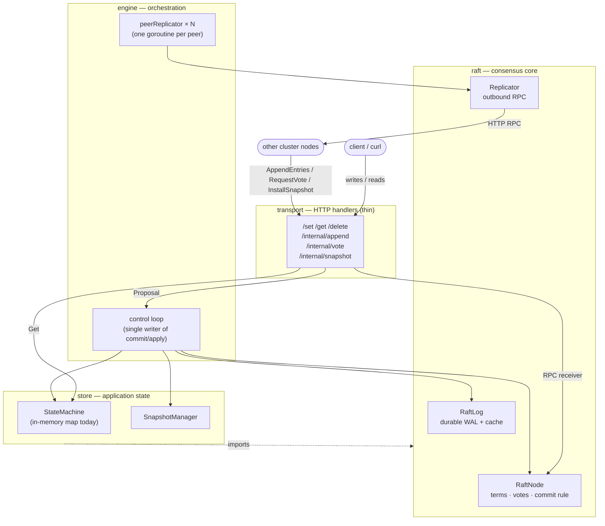
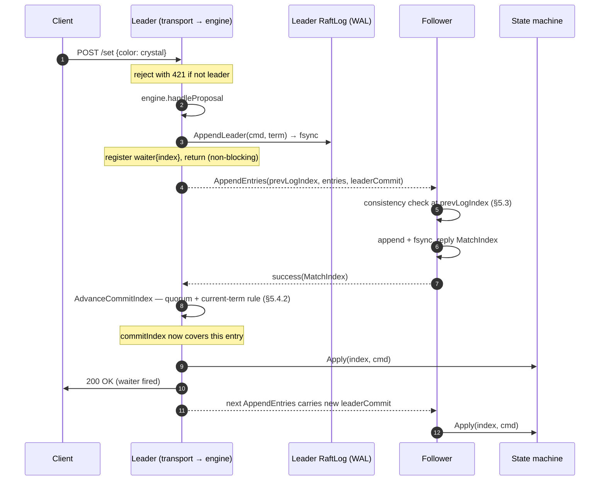
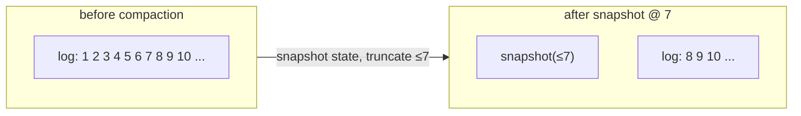

# Crystal architecture

This document is the guided tour. It explains how a write travels through the
system, why the layers are drawn where they are, and how the concurrency model
keeps consensus race-free. For the mapping to the Raft paper itself — the safety
arguments, Figure 2 line by line — see **[RAFT.md](RAFT.md)**. For the runtime in
full detail — every goroutine, every channel, and who owns which field — see
**[CONCURRENCY.md](CONCURRENCY.md)**.

---

## The one-paragraph mental model

A Crystal node is a **state machine driven by a replicated log**. Clients don't
mutate the key-value map directly; they append *commands* to a log. Raft's job is
to make every node agree on the same log in the same order. Once an entry is
*committed* (safely stored on a majority), each node feeds it to its local state
machine, and because they all apply the same commands in the same order, they all
end up in the same state.

> _"Consensus algorithms typically arise in the context of replicated state
> machines … Keeping the replicated log consistent is the job of the consensus
> algorithm."_ — Raft paper, §2

Everything below is in service of that sentence.

---

## Layers

Crystal is split into packages with a strict, one-directional dependency arrow.
The point of the split is that **the consensus layer knows nothing about HTTP or
key-value semantics**, and the storage layer knows nothing about elections or
terms. Each can change without disturbing the other.



Read the dashed arrow carefully: **`store` imports `raft`, never the reverse.**
The Raft layer moves opaque `[]byte` commands (`LogEntry.Command`) and never
decodes them. Only the state machine knows a command is a `set` or a `delete`.
That is the seam that will let a future LSM-tree storage engine drop in without a
single change to consensus code.

| Package | Responsibility | Deliberately does *not* know about |
|---------|----------------|-----------------------------------|
| `transport` | Decode HTTP, validate, delegate | Terms, quorums, the log |
| `engine` | Drive the loop; own commit/apply timing | HTTP; how an RPC is serialized |
| `raft` | Terms, votes, log matching, the commit rule | HTTP, key-value semantics |
| `store` | Apply commands, snapshot/restore | Elections, replication, terms |

---

## The life of a write

Here's a `set color=crystal` from the client's `curl` to the point where a
majority of nodes have durably stored it and applied it. This is the path that
ties every layer together.



The subtle part is step **4–6**: `AppendLeader` fsyncs *before* the entry is
even sent to followers, and each follower fsyncs before acknowledging. Only once
a majority has acknowledged does the leader advance `commitIndex` — and only if
the quorum entry is from the **current term** (the Figure 8 rule; see
[RAFT.md](RAFT.md#the-figure-8-commit-rule)). The client's `200 OK` is released
by the control loop the instant `commitIndex` passes the waiter's index.

---

## The concurrency model (why it's fast *and* correct)

This is the part worth internalizing. Naïvely, a leader handling a write would
loop over its peers sending AppendEntries and blocking on each reply. One slow or
dead peer then drags every write toward the RPC timeout. Crystal uses the
**etcd-style split**: separate the goroutine that *decides* things from the
goroutines that *talk to the network*.

```mermaid
flowchart LR
    subgraph control["control goroutine (Run)"]
        direction TB
        c1["the ONLY writer of<br/>CommitIndex / LastApplied"]
        c2["apply committed entries"]
        c3["run elections"]
        c4["fire / sweep client waiters"]
        c5["compact"]
    end

    subgraph replicators["per-peer replication goroutines"]
        r1["peerReplicator 1"]
        r2["peerReplicator 2"]
        r3["peerReplicator N"]
    end

    props[["proposals chan"]] --> control
    control -->|notify (depth-1)| replicators
    replicators -->|UpdatePeerProgress<br/>BacktrackNextIndex| node["RaftNode<br/>(its own lock)"]
    replicators -->|higher term seen| stepdown[["stepDownCh (buffered)"]]
    stepdown --> control
```

The rules that make this safe:

1. **One writer.** Only the control loop advances `CommitIndex` / `LastApplied`
   and applies entries. There is no lock dance around commit/apply because
   there is no second writer. This is the single most important invariant in the
   engine.
2. **Replicators only slow themselves.** Each peer gets one long-lived goroutine
   that owns *all* outbound latency to that peer. A black-holed follower stalls
   its own loop and nothing else — heartbeats to healthy peers, client
   proposals, and commit advancement all keep flowing. Measured effect: with one
   peer dead, writes commit in **~180 ms** instead of being dragged toward the
   1 s RPC timeout.
3. **Replicators never write consensus state.** They call only the node's
   already-locked progress mutators (`UpdatePeerProgress`, `BacktrackNextIndex`)
   and, if they see a higher term, hand it to the control loop over a buffered
   channel. The decision to step down is still made by the one writer.
4. **Proposals are non-blocking.** A write appends to the log, registers a
   `waiter{index, resultCh, deadline}`, and returns. The control loop resolves it
   later — fired when `commitIndex` passes the index, swept with
   `ErrCommitTimeout` past its deadline, or failed with `ErrNotLeader` on
   step-down. No client request ever blocks a consensus-critical goroutine.

### Two locks, never held together

Inside the raft package there are exactly two locks: `RaftNode.mu` (term, role,
vote, commit) and `RaftLog.mu` (the WAL and cache). **They are never held
simultaneously by the same goroutine.** Any operation that needs both reads what
it needs from one, releases it, then takes the other — which is why methods like
`AdvanceCommitIndex` take a `termAt func(int) int` callback instead of reaching
into the log directly. It's a deliberate deadlock-avoidance discipline, called
out at the top of [`node.go`](../internal/raft/node.go).

---

## Durability: the write-ahead log

A node must not lose a committed entry across a crash, and it must not vote twice
in one term across a restart. Two on-disk artifacts guarantee this.

**The WAL** (`raft.wal`) is an append-only file of framed entries:

```
┌────────────┬──────────────────────┐┌────────────┬─────────────
│ 4-byte len │  JSON LogEntry (len)  ││ 4-byte len │  JSON ...
└────────────┴──────────────────────┘└────────────┴─────────────
```

The length prefix is what makes recovery reliable: read 4 bytes, then read
*exactly* that many. A crash mid-write leaves a partial trailing frame, detected
as an unexpected EOF and truncated away on the next boot. Every append is
`fsync`'d before it's acknowledged.

There's a Windows-flavored gotcha baked into the design. The WAL is opened
`O_APPEND`, under which **every write goes to end-of-file regardless of seek
position**, and (on Windows) `Truncate` on that handle is rejected outright. So
any path that must *shrink or overwrite* the log — follower conflict truncation,
or compaction — can't rewrite in place. It writes a fresh `.rewrite` temp file,
fsyncs, and atomically renames it over the WAL. That rename is also crash-safe: a
crash mid-rewrite leaves the original WAL fully intact.

**The metadata file** (`raft.meta`) is a tiny JSON blob holding `currentTerm` and
`votedFor`, rewritten (temp-file + rename) on every term change. It's separate
from the WAL because the WAL is append-only but this state needs *in-place*
updates. Losing it would let a restarted node vote a second time in a term it had
already voted in — a direct safety violation.

---

## Compaction and snapshots

An append-only log grows without bound. Compaction bounds it: once entries are
committed and applied, their *effect* is captured in the state machine, so the
entries themselves can be discarded.



When the cache passes `-compaction-threshold` entries, the engine snapshots the
state machine to `snapshot.json`, then calls `TruncateBeforeIndex` to drop the
covered WAL entries. The log now *starts* at index 8, not 1 — so all index math
routes through `cacheIdx = index - firstIndex`, and the snapshot boundary's term
(`lastIncludedTerm`) is retained even though its entry is gone, because the
consistency check for the first post-snapshot entry still needs it (Figure 12).

If a follower falls so far behind that the leader has already compacted the
entries it needs, log shipping can't help — the entries don't exist anymore. The
leader ships the whole snapshot with the **InstallSnapshot** RPC (Figure 13)
instead. The replicator detects this automatically: when a peer's `nextIndex`
drops below the leader's `FirstIndex()`, it sends a snapshot instead of an
AppendEntries. See [RAFT.md](RAFT.md#log-compaction-7) for the receiver logic.

---

## Testing strategy

Two layers, two questions.

**Unit tests** answer *"is this invariant correct?"* — the ones that are easy to
get subtly, silently wrong and impossible to eyeball:

- the Figure 8 commit rule (`TestAdvanceCommitIndex_Figure8`)
- the dual-leader step-down race (`TestBecomeLeader_NoOpAfterStepdown`)
- same-term vote preservation (`TestBecomeFollower_SameTermPreservesVote`)
- WAL partial-frame recovery and conflict-truncation rewrite
- the compaction index math (`TestCompactionPreservesIndexMath`, `TestRecoverCompactedWAL`)
- the non-blocking waiter lifecycle

**Integration tests** (build tag `integration`) answer *"does the whole thing
actually agree?"* They compile the binary, launch a real 3-node cluster over
HTTP, and exercise the scenarios you can't fake in a unit test:

- elect a leader, kill it, assert **re-election**
- assert **committed data survives** the leader change
- rejoin the dead node and watch it **converge**
- knock a follower behind past a compaction and prove it **catches up via
  InstallSnapshot** (`TestFollowerCatchesUpViaSnapshot`)

```bash
go test ./...                                          # unit — fast, hermetic
go test -tags integration ./internal/integration -v    # integration — real cluster
```

The characterization here is deliberate: a bug in the commit rule might never
show up in a happy-path integration run, but it's a one-line unit test. And a
deadlock between two goroutines will never show up in a unit test, but the
integration cluster will hang on it. You need both.
