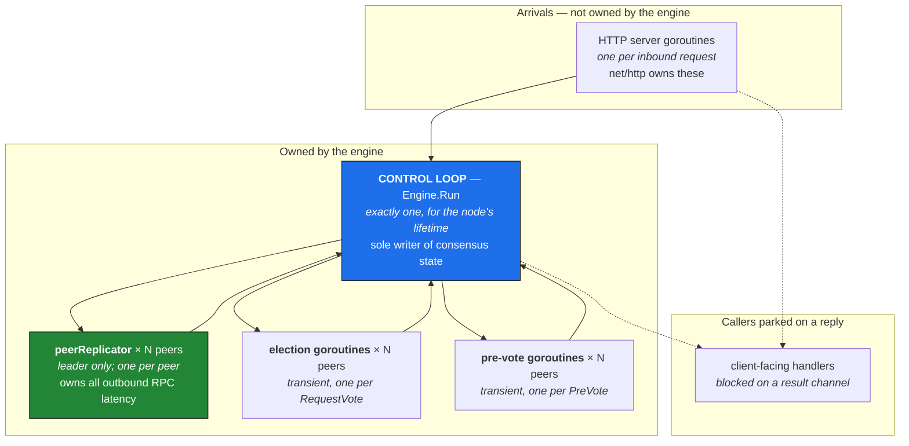
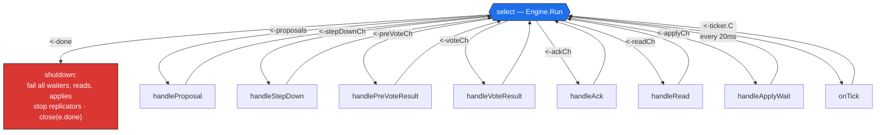
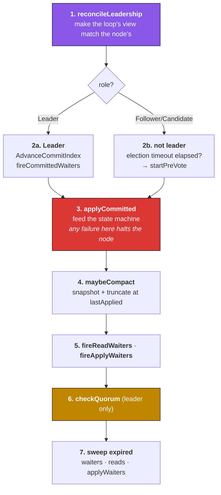
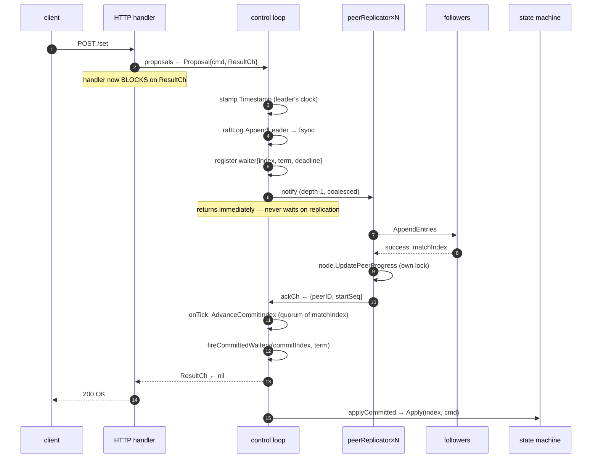
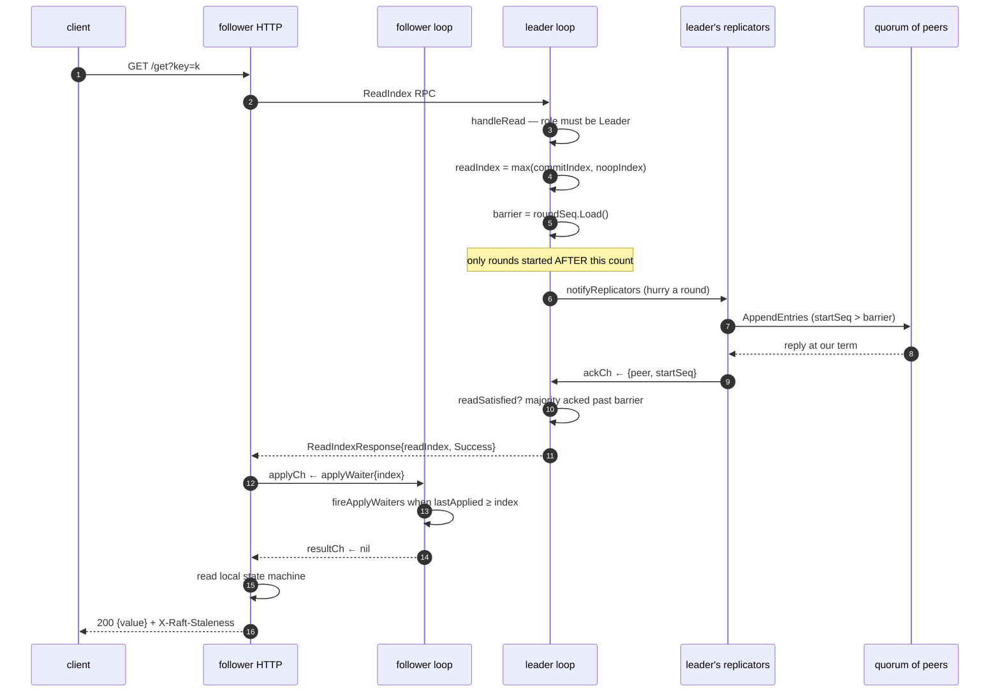
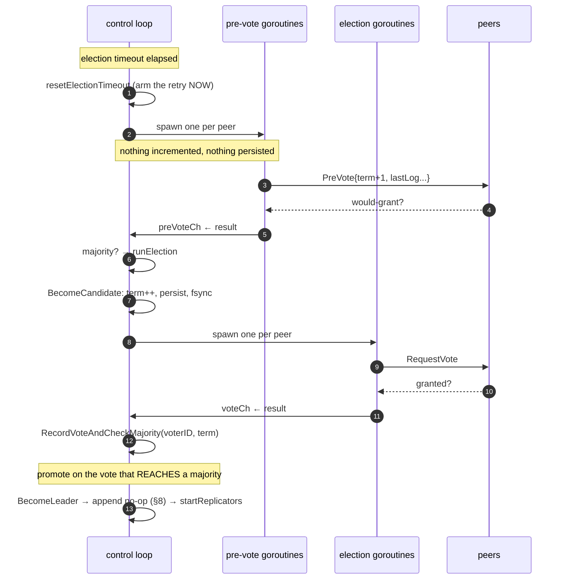
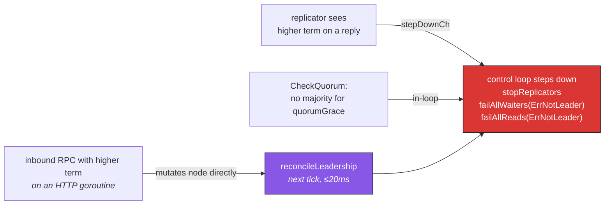
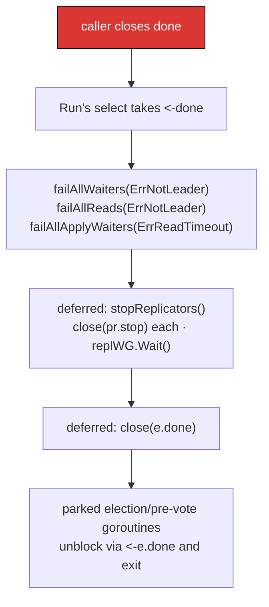

# Crystal concurrency — the engine, the control loop, and every channel

This document is the map of Crystal's runtime. It exists because consensus code
fails in a specific way: not by crashing, but by two goroutines disagreeing about
state that only one of them was supposed to own. Every rule below is here to make
that impossible, and each one is written next to the bug it prevents.

Companion documents: **[ARCHITECTURE.md](ARCHITECTURE.md)** (how a write travels
through the layers) and **[RAFT.md](RAFT.md)** (how the code maps to the paper).

---

## The governing rule

> **One goroutine — the control loop — is the only writer of consensus state.**
> Everything else either hands it a message and waits, or touches state that is
> explicitly published for concurrent access.

"Consensus state" means the commit index, the applied index, the role, the
waiter lists, and the leadership-evidence table. Not the log, not the persistent
term — those have their own locks — but the decisions *about* them.

The reason is that Raft's dangerous operations are read-modify-write sequences
over several fields at once. "Advance the commit index if a majority has this
index and the entry is from my term" reads `matchIndex`, the log, and the term,
then writes `commitIndex`. Under a mutex, that is four opportunities to hold the
wrong lock. Under a single owning goroutine, it is a straight line of code that
cannot interleave with itself.

Everything else in this document follows from that sentence.

---

## The goroutine census

At any instant a node runs the following goroutines. Nothing else touches engine
state.

| Goroutine | Count | Lifetime | Owns |
|---|---|---|---|
| **Control loop** (`Engine.Run`) | exactly 1 | whole process | commit/apply indices, role transitions, all waiter lists, `lastAck` |
| **peerReplicator** (`pr.run`) | one per peer, **leader only** | from promotion to stepdown | outbound AppendEntries/InstallSnapshot to *its* peer; nothing else |
| **Election goroutine** | one per peer, per election | one RPC | nothing — sends a request, forwards the reply |
| **Pre-vote goroutine** | one per peer, per poll | one RPC | nothing |
| **HTTP handler** | one per request (`net/http`) | one request | nothing; it borrows via locks or channels |

Two structural consequences:

- **A slow peer slows only itself.** All RPC latency lives in that peer's own
  replicator. A black-holed follower cannot stall heartbeats to healthy peers,
  block a client write, or delay the control loop.
- **The control loop never makes a network call.** Not one. If it did, a single
  unreachable peer would stop commits, applies, elections, and every pending
  client request at once.

---

## Every channel in the engine

All of them. Buffer sizes are from
[engine.go](../internal/engine/engine.go#L188-L206); `P` is the peer count.

| Channel | Type | Buffer | From → To | Carries |
|---|---|---|---|---|
| `proposals` | `Proposal` | 100 | HTTP → loop | a client write to append |
| `stepDownCh` | `int` | P+1 | replicators → loop | a higher term seen on a reply |
| `voteCh` | `voteResult` | P+1 | election goroutines → loop | one RequestVote reply |
| `preVoteCh` | `preVoteResult` | P+1 | pre-vote goroutines → loop | one PreVote reply |
| `ackCh` | `ackReport` | 4×(P+1) | replicators → loop | proof a peer still recognizes us |
| `readCh` | `Read` | 100 | HTTP → loop | a request to admit a read index |
| `applyCh` | `applyWaiter` | 100 | HTTP → loop | "wake me when applied ≥ N" |
| `pr.notify` | `struct{}` | **1** | loop → one replicator | "new work, send now" |
| `pr.stop` | `struct{}` | 0 (closed) | loop → one replicator | terminate |
| `done` | `struct{}` | 0 (closed) | loop → everyone | the loop has exited |
| `Proposal.ResultCh` | `error` | 1 | loop → one HTTP handler | commit outcome |
| `Read.ResultCh` | `readResult` | 1 | loop → one HTTP handler | read index or refusal |
| `applyWaiter.resultCh` | `error` | 1 | loop → one HTTP handler | apply reached, or timeout |

**Every buffer size is load-bearing:**

- **`P+1` on the vote channels** is one slot per possible replier, so an election
  goroutine can always deposit its reply and exit even if the control loop is
  busy elsewhere. No goroutine leaks waiting to be heard.
- **Depth 1 on `pr.notify`** makes the nudge *coalescing*, not queueing. Ten
  proposals in a burst produce at most one pending wake-up, and the replicator
  reads the latest log state when it runs. A deeper buffer would queue redundant
  rounds; an unbuffered one would make the control loop wait on a replicator.
- **Buffer 1 on every reply channel** means the control loop never blocks
  delivering a result, even if the client has already timed out and walked away.
  A zero-buffer reply channel would deadlock the entire node against one departed
  client.
- **`4×(P+1)` on `ackCh`** absorbs several rounds per peer in flight. Sends are
  non-blocking with a `default:` drop — a lost ack costs one extra round of read
  latency, whereas a blocked replicator costs liveness.

---

## The control loop

One `select`, seven cases, and a 20 ms tick. This is the entire consensus
scheduler ([engine.go:244](../internal/engine/engine.go#L244)):

### `onTick` — the ordered pass

The tick body is a fixed sequence, and **the order is a correctness property,
not a style choice** ([engine.go:395](../internal/engine/engine.go#L395)):

Why this order and no other:

1. **`reconcileLeadership` runs first** because leadership can change *out from
   under the control loop*. An inbound higher-term RPC deposes this node inside
   the receiver, on an HTTP goroutine, and nothing tells the loop. Rather than
   trying to intercept every path that can depose a node, the loop observes the
   truth once per tick and makes its own state match. Everything below assumes
   the two agree.
2. **Apply before compact.** Compaction snapshots the state machine, so it must
   run against state that has actually absorbed everything being discarded.
3. **Reads fire after apply**, because a read waiting on `lastApplied` may have
   become satisfiable in step 3.
4. **`checkQuorum` runs *after* the read pass**, so a leader about to step down
   still gets one chance to satisfy reads it can legitimately serve.
5. **Sweeps run last**, so nothing expires in the same tick it could have been
   satisfied.

---

## Message flows

### A write, end to end

The acknowledgement carries a subtlety worth stating outright. A waiter records
both an **index and a term**, and `fireCommittedWaiters` requires both to match.
An index alone does not identify an entry: if this node is deposed and later
re-elected, the index the client waits on may by then hold a *different leader's*
entry. Acking on index alone would tell the client its write committed when what
actually committed was somebody else's — a linearizability violation the client
has no way to detect.

### A linearizable read on a follower

The read that scales. Only an integer crosses the network; the data never leaves
the node that answers.

**The barrier is the whole mechanism.** An ack proves a follower recognized our
leadership at some point *after its round started* — so a round begun at T=0 and
returning at T=100 says nothing about a read admitted at T=50. Counting it would
confirm a quorum using evidence that predates the read, which is exactly the
stale-read hole the mechanism exists to close. Rounds are therefore *numbered
before they are sent*, and a read only counts acks whose `startSeq` exceeds the
barrier captured at admission.

This was a real bug, found and fixed here.

### Election: pre-vote, then the real thing

Three things this diagram encodes:

**Pre-vote spends nothing.** No term increment, no disk write. An isolated node
times out repeatedly, and if each timeout bumped its term it would return with a
term far ahead of everyone else — a term that propagates through the
*AppendEntries response* it sends the leader, which Figure 2 obliges the leader
to honor by stepping down. A node that was never a viable candidate deposes a
working one, repeatedly. Asking first means the term only moves once a majority
says a campaign could succeed.

**Elections do not block the loop.** `runElection` returns immediately. It used
to gather votes inline and end in `wg.Wait()`, which was wrong twice over: it
blocked the control loop for as long as the slowest peer took to answer, and it
waited for *all* peers when §5.2 says a candidate wins the moment a majority
arrives. With a 300–600 ms election timeout and a 1 s RPC timeout, a single
black-holed peer made every election overrun its own timeout — so elections
re-armed before they could finish, and the cluster could fail to elect at all.

**The vote tally records *who*, not how many.** Under a joint configuration the
same number of votes can be a majority of both memberships or of neither,
depending on which servers they came from.

### Stepdown — three paths to one place

Path **B** is why `reconcileLeadership` exists. The RPC receiver deposes the node
on an HTTP goroutine and the control loop is never told. Left unreconciled:

- replicators keep running, still carrying the term they were started for;
- on re-election they would resume under the *new* term while reporting against
  the *old* one, so every ordinary reply reads as a higher term and triggers a
  stepdown — a leader deposing itself moments after winning;
- waiters registered under the old term survive, and can be acknowledged against
  an index that now belongs to a different leader's entry.

`handleStepDown`'s guard is a plain term comparison, deliberately. It once also
required `!IsLeader()`, which inverted the intent: a stale report whose term was
*not* higher would pass the guard precisely when this node was leader — the one
case where acting on it does the most damage.

**CheckQuorum** (path C) is not required by Raft: a partitioned leader cannot
commit anything, so safety holds without it. It is required by everything *built
on* leadership — clients redirected to a node that still answers "I am the
leader" are taken at their word. Note that it steps down **at the same term**:
there is no evidence of a higher one, only evidence that we can no longer prove
we lead this one. Inventing a term bump would disrupt whichever leader the
majority side has already settled on.

---

## State ownership

The rule that makes the whole thing legible:

| State | Owner | How others touch it |
|---|---|---|
| `commitIndex`, `lastApplied` | control loop | `RaftNode.mu`, published via `CommitAndApplyBoundary()` |
| `waiters`, `reads`, `applyWaiters` | **control loop only** | never — they are plain slices with no lock |
| `lastAck`, `noopIndex`, `preVotes` | **control loop only** | never |
| `replicators`, `replicatorsTerm` | control loop | never |
| `role`, `term`, `votedFor`, `LeaderID` | `RaftNode.mu` | RPC receivers and the loop both take the lock |
| `NextIndex`, `MatchIndex` | `RaftNode.mu` | replicators mutate via `UpdatePeerProgress` / `BacktrackNextIndex` |
| WAL + entry cache | `RaftLog.mu` | its own lock, always |
| `roundSeq` | atomic | replicators claim, loop reads |
| `lastQuorumNanos` | atomic | loop writes, RPC goroutines read |
| `snapCache` | `snapCacheMu` | replicator goroutines, not the loop |

Four fields are unguarded slices — `waiters`, `reads`, `applyWaiters`,
`lastAck` — and that is the payoff. They need no lock because exactly one
goroutine ever touches them. If you find yourself wanting a mutex for one of
these, the actual bug is that something outside the control loop is reaching for
state it does not own.

### Lock order

> **`RaftNode.mu` → `RaftLog.mu`. Never the reverse.**

The log never calls back into the node. Where the node needs log state inside a
critical section — the §5.4.1 up-to-dateness comparison during a vote — it takes
a **function** (`lastLogState func() (int, int)`) rather than a pre-read
snapshot, so the comparison reflects the log as it stands *inside* the vote's
critical section rather than as it was before the lock was taken.

The atomics exist precisely to avoid needing a third lock: `lastQuorumNanos` is
written by the control loop and read by RPC goroutines serving bounded reads, and
making that a mutex would put a lock between every read and the tick.

---

## Timing constants

From [engine.go:35-52](../internal/engine/engine.go#L35-L52) and
[quorum.go:41-53](../internal/engine/quorum.go#L41-L53):

| Constant | Value | Role |
|---|---|---|
| `tickInterval` | 20 ms | control-loop cadence; bounds reconcile latency |
| `heartbeatInterval` | 100 ms | per-replicator idle round |
| `electionTimeoutMin/Max` | 300–600 ms | randomized per node, per election (§5.2) |
| `replicationTimeout` | 1 s | bounds one outbound RPC |
| `proposalTimeout` | 2 s | a write's commit deadline |
| `readTimeout` (engine) | 2 s | quorum confirmation deadline |
| `readTimeout` (transport) | 3 s | deliberately longer, so the engine's specific error reaches the client instead of being masked |
| `quorumGrace` | = `electionTimeoutMax` | CheckQuorum patience |

The relationships matter more than the numbers:

- `heartbeatInterval` (100 ms) **must be comfortably below** `electionTimeoutMin`
  (300 ms), or a live leader's heartbeats fail to reset follower timers and the
  cluster elects over a leader that is working fine.
- The **randomized** election range desynchronizes repeated split votes; a fixed
  timeout makes candidates collide in lockstep.
- `quorumGrace` equals the max election timeout because that is how long the
  other side of a partition takes to replace us. Stepping down sooner churns on
  transient slowness; later widens the window in which two nodes both answer to
  "leader".
- The transport read timeout **exceeds** the engine's on purpose: the inner
  deadline should fire first so the client learns *why* the read was refused.

---

## Shutdown

Note the two distinct channels. `done` (the parameter) is the caller's stop
signal; `e.done` is the engine's own "I have exited" broadcast. Election and
pre-vote goroutines outlive a single election attempt, so every send to `voteCh`
and `preVoteCh` selects on `e.done` as an escape — without it, a goroutine
holding a reply for an election nobody is tallying anymore would leak past
shutdown.

`stopReplicators` is idempotent and waits on a `WaitGroup`, so no replicator can
outlive the engine and issue an RPC against a closed log.

---

## Testing this

Concurrency bugs of this shape do not reproduce under a stress loop; they need a
specific interleaving at a specific instant. The in-process harness
([internal/testcluster/](../internal/testcluster/)) runs a whole cluster in one
process over a fake network so a test can:

| Capability | Method |
|---|---|
| Cut one direction only | `Cut(from, to)` |
| Isolate a node entirely | `Isolate(id)` / `Heal(id)` |
| Black-hole vs. refuse | `SetBlackholeDelay(d)` |
| Inject loss and latency | `SetDropRate(p)` / `SetDelay(d)` |
| Assert the core invariant continuously | `CheckSingleLeaderPerTerm()` |

Two lessons from this codebase, both of which cost a wrong turn:

**A test that passes may be proving nothing.** Several tests here passed against
the *broken* implementation. The TOCTOU on term adoption needed a rendezvous
hook, not a stress loop. The election test failed to catch its bug because the
fake network cut links *instantly* — which models a refused connection, not a
black hole; `SetBlackholeDelay` is what made it real. Run every new concurrency
test against the unfixed code before trusting it.

**Sometimes the test is wrong, not the code.** Two tests here asserted things
that were not actually invariants. Establish which of the two is wrong before
"fixing" anything.

CI runs the full suite under `-race` on Linux (the race detector needs cgo,
unavailable on the Windows dev box) and repeats the harness three times, because
a single green run hides a flake.
